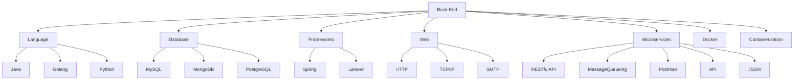
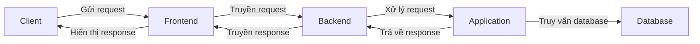

<p align="center">
    
    
</p>

[](https://github.com/hoangtien2k3qx1/Java/blob/main/DIRECTORY.md)
[](https://discord.gg/cFAkCXVQ)
[](https://gitpod.io/#https://github.com/hoangtien2k3qx1)

Full My [**Directory**](DIRECTORY.md) has the full list of applications. [backend](https://github.com/hoangtien2k3qx1/Java/blob/main/src/java/ProgrammingBook/roadmap-backend.pdf)

### All Project are implemented in Java.
These implementations are intended for learning purposes. As such, project java may be less efficient than the Java standard library.


[hệ thống booking bằng micro service hỗ trợ chịu tải lớn bằng Java và Spring boot, MySQL](https://viblo.asia/p/thiet-ke-chi-tiet-he-thong-booking-bang-micro-service-ho-tro-chiu-tai-lon-bang-java-va-spring-boot-mysql-AZoJjXeyVY7?fbclid=IwAR3XuTJSOxyYNQ_xHfu17_K-GnmdfAvZiEfNsUSv2AUhG2-PSgNAHnth0nM)








```mermaid
graph LR;
    A[Backend Developer] -- Ngôn ngữ lập trình --> B[Programming Language]
    A -- Framework --> C[Web Framework]
    A -- Cơ sở dữ liệu --> D[Database]
    A -- Server --> E[Web Server]
    A -- RESTful API --> F[API]
    A -- Các công cụ phát triển --> G[Development Tools]
    A -- Kiến trúc phân tán --> H[Distributed Architecture]
    A -- Triển khai --> I[Deployment]

    subgraph Programming Language
        B -- Syntax --> J
        B -- Data Types --> K
        B -- Control Flow --> L
        B -- Functions --> M
        B -- Object-Oriented Programming --> N
    end

    subgraph Web Framework
        C -- Routing --> O
        C -- Model-View-Controller (MVC) Architecture --> P
        C -- ORM/ODM --> Q
        C -- Middleware --> R
        C -- Authentication and Authorization --> S
    end

    subgraph Database
        D -- Relational Databases --> T
        D -- Non-Relational Databases --> U
        D -- Data Modeling --> V
        D -- Querying and Manipulating Data --> W
        D -- Transactions and Concurrency --> X
    end

    subgraph Web Server
        E -- HTTP Protocol --> Y
        E -- Reverse Proxy --> Z
        E -- Load Balancing --> AA
        E -- Caching --> AB
        E -- Security --> AC
    end

    subgraph Development Tools
        G -- Integrated Development Environment (IDE) --> AD
        G -- Version Control System (VCS) --> AE
        G -- Testing Framework --> AF
        G -- Debugging Tools --> AG
        G -- Build and Deployment Tools --> AH
    end

    subgraph Distributed Architecture
        H -- Microservices --> AI
        H -- Service-Oriented Architecture (SOA) --> AJ
        H -- Message Queues --> AK
        H -- Event-Driven Architecture --> AL
        H -- Containers and Orchestration --> AM
    end

    subgraph Deployment
        I -- Infrastructure as a Service (IaaS) --> AN
        I -- Platform as a Service (PaaS) --> AO
        I -- Continuous Integration and Continuous Deployment (CI/CD) --> AP
        I -- Scalability --> AQ
        I -- Monitoring and Logging --> AR
    end

