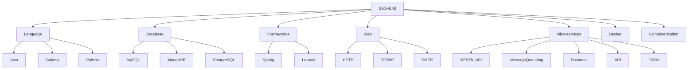
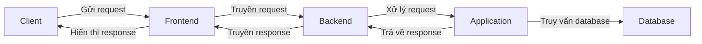

    
    

Full My [**Directory**](DIRECTORY.md) has the full list of applications. [backend](https://github.com/hoangtien2k3qx1/Java/blob/main/src/java/ProgrammingBook/roadmap-backend.pdf)

### All Project are implemented in Java.
These implementations are intended for learning purposes. As such, project java may be less efficient than the Java standard library.

[hệ thống booking bằng micro service hỗ trợ chịu tải lớn bằng Java và Spring boot, MySQL](https://viblo.asia/p/thiet-ke-chi-tiet-he-thong-booking-bang-micro-service-ho-tro-chiu-tai-lon-bang-java-va-spring-boot-mysql-AZoJjXeyVY7?fbclid=IwAR3XuTJSOxyYNQ_xHfu17_K-GnmdfAvZiEfNsUSv2AUhG2-PSgNAHnth0nM)

