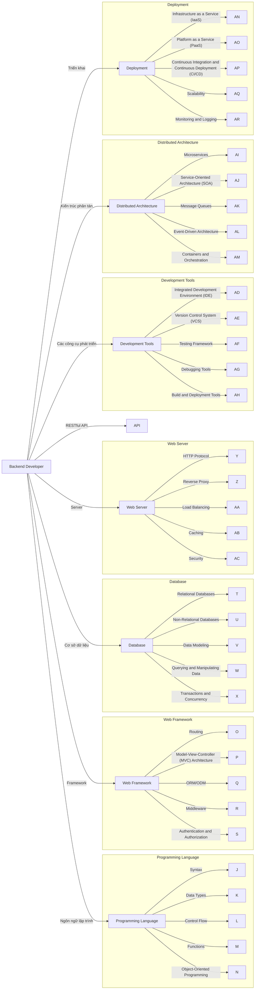

#### [1. backend-roadmap](https://drive.google.com/file/d/1TJOYRf4tuRDxRBQGOs00mArmcmzK6UjV/view)
#### [2. backend-roadmap](https://topdev.vn/blog/wp-content/uploads/2018/08/1_WQviQNNE2cnhVAiQpIXkQg.png)

